# AlphaWord Blocks

<p align="center">
  <a href="https://donate.stripe.com/eVa6pK4XQ5Qg6vmbII"></a>
</p>

<p align="center">
  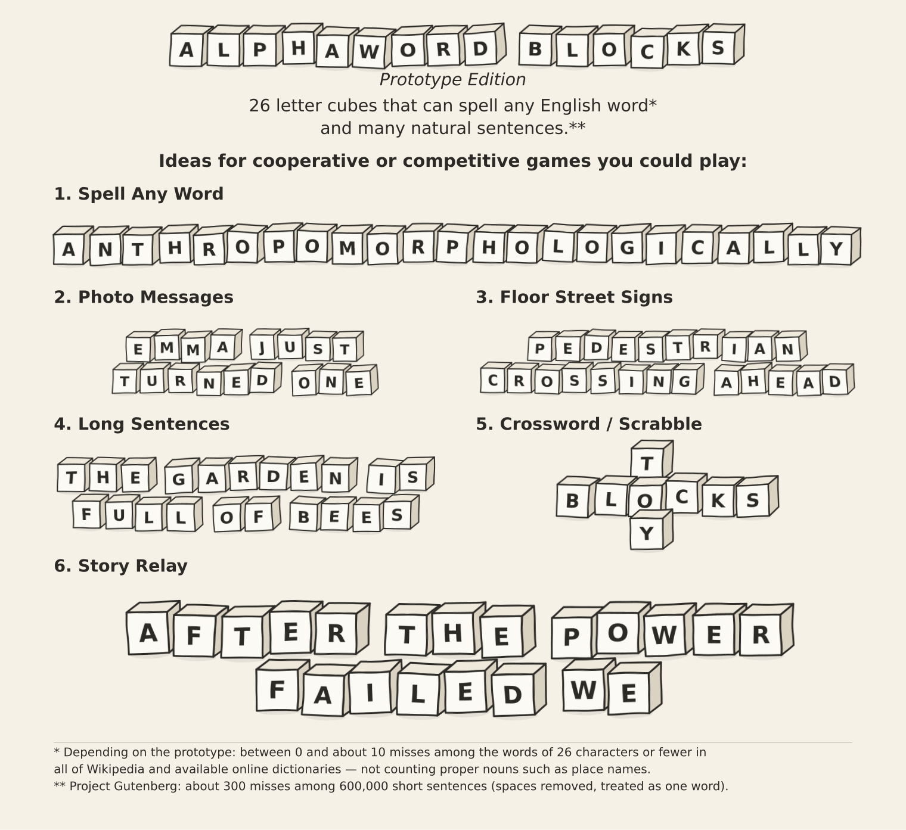
</p>

A child's set of alphabet blocks comes with a disappointment built in. Sooner or
later you want to spell a word with a repeated letter in it — `moon`, `book`, your
own name — and find that the set carries only one block bearing that letter, or
that the second copy is already busy holding down another part of the word. The
disappointment is not cheap manufacturing; it is a real combinatorial obstruction,
and removing it is what this repository is about. AlphaWord Blocks searches for a
small, fixed set of six-sided letter cubes — twenty-six of them for English, one
per letter of the alphabet — so that almost any word you are ever likely to write
can be laid out, one cube per letter, with the right faces turned up.

What we found is that twenty-six cubes are enough for very nearly the whole
language. The set bundled here misses, depending on the version, somewhere between
zero and about ten of the words of twenty-six letters or fewer in all of Wikipedia
once proper nouns such as place names are set aside, and it spells all but roughly
three hundred of six hundred thousand short Project Gutenberg sentences after the
spaces are removed and each sentence is treated as one long word. We make no claim
that twenty-six is the smallest number of cubes that would do; it is the natural
choice — one cube per letter — which also caps the longest spellable word at
twenty-six letters. The same program, pointed at the thirty letters of Bulgarian,
returns thirty cubes. The alphabet is a runtime choice, so nothing below is
specific to English.

## Fun games to play

The instruction sheet up top shows six ways to play — spell any word, photo
messages, floor signs, long sentences, crossword, and a story relay. Here is another example of a fun game to play starting with any seed word:  

<a href="endcap.png">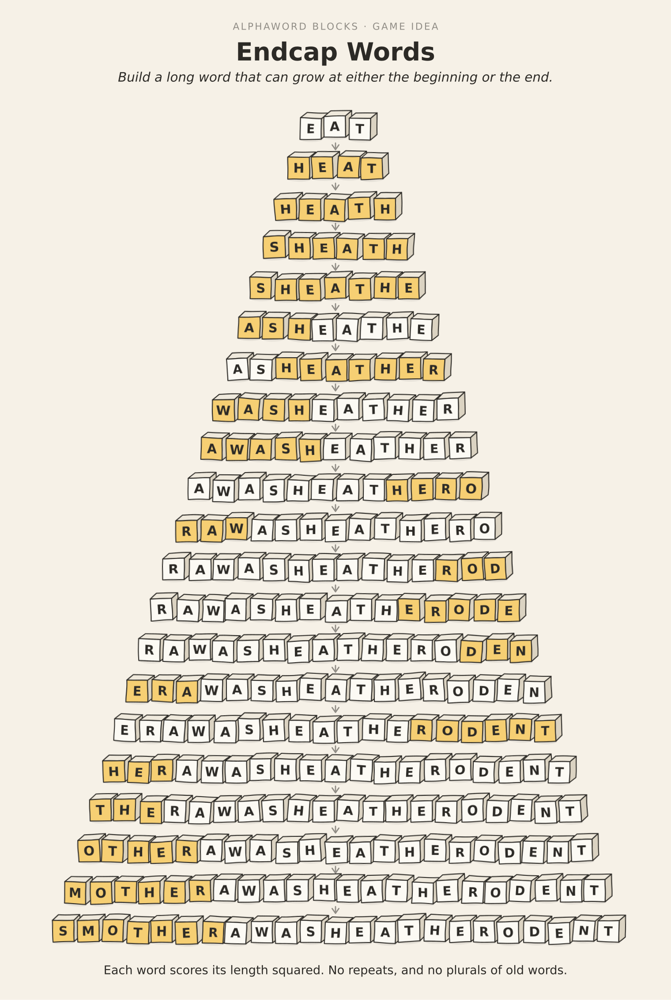</a>


And here are
nine more, one game per card. Everything shown on a card can be laid out at the
same time with the single 26-cube set; the Word Chain even uses all twenty-six
at once.


<table>
  <tr>
    <td width="33%" align="center"><a href="idea_chain.png">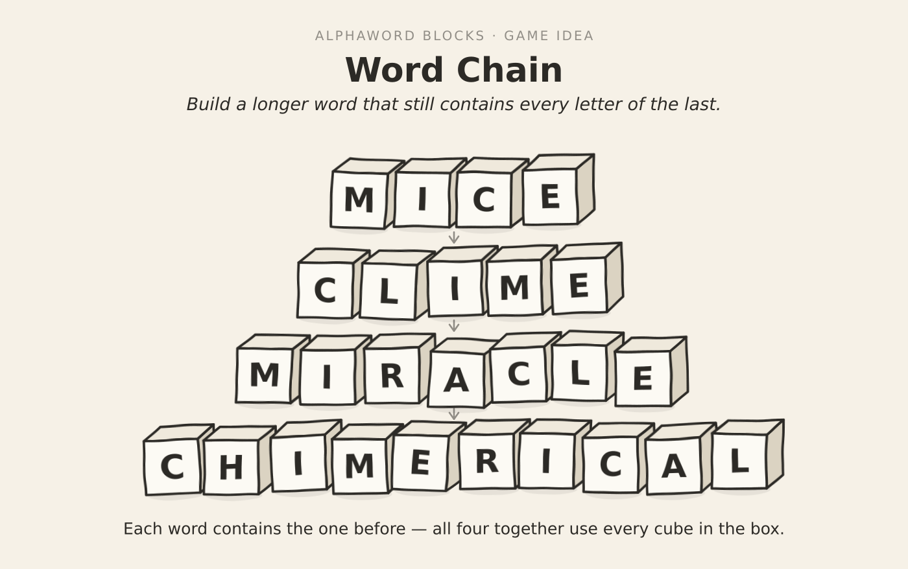</a><br><b>Word Chain</b><br><sub>each word contains the one before — all four use every cube</sub></td>
    <td width="33%" align="center"><a href="idea_rhyme.png">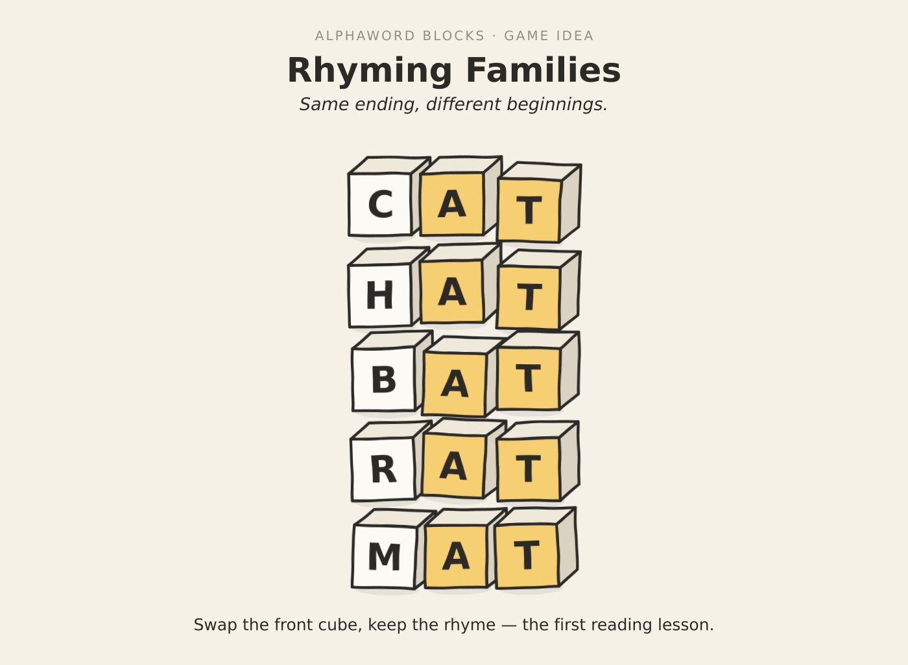</a><br><b>Rhyming Families</b><br><sub>keep the ending, swap the front cube</sub></td>
    <td width="33%" align="center"><a href="idea_ladder.png">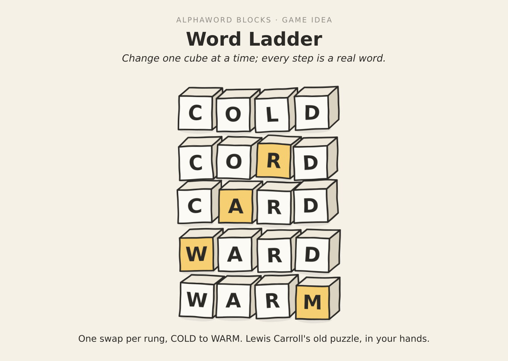</a><br><b>Word Ladder</b><br><sub>change one cube at a time</sub></td>
  </tr>
  <tr>
    <td align="center"><a href="idea_staircase.png">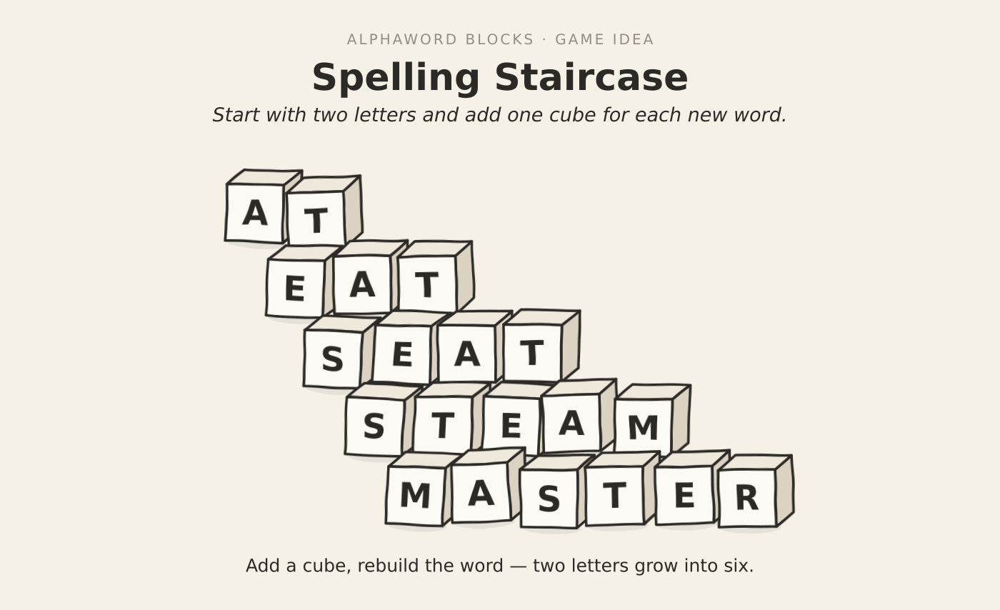</a><br><b>Spelling Staircase</b><br><sub>add a cube, rebuild the word</sub></td>
    <td align="center"><a href="idea_tower.png">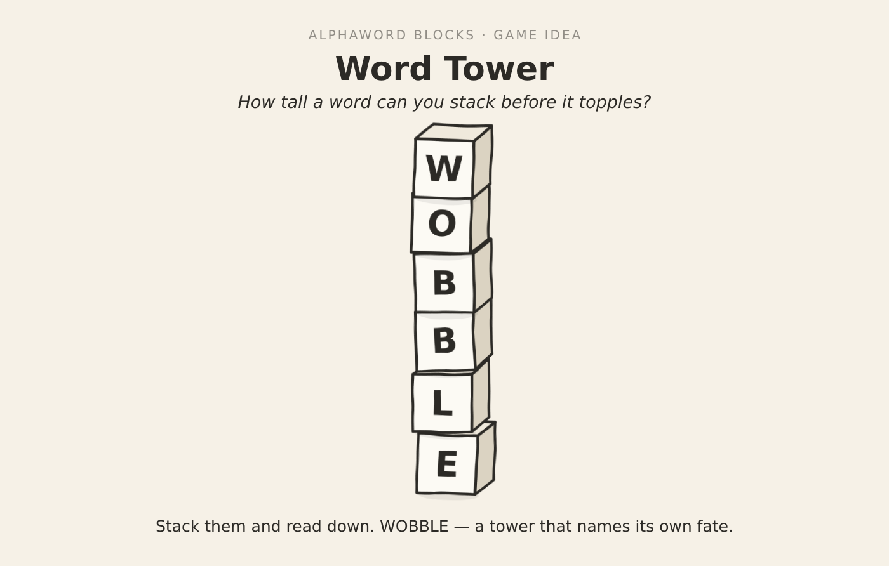</a><br><b>Word Tower</b><br><sub>stack them and read top to bottom</sub></td>
    <td align="center"><a href="idea_code.png">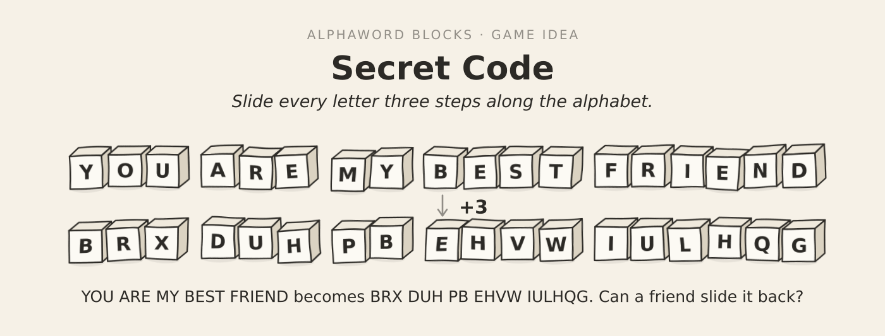</a><br><b>Secret Code</b><br><sub>shift each letter three along the alphabet</sub></td>
  </tr>
  <tr>
    <td align="center"><a href="idea_anagram.png">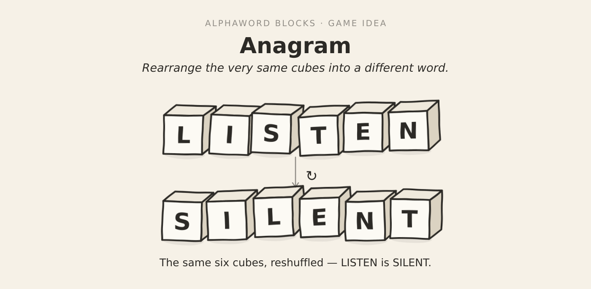</a><br><b>Anagram</b><br><sub>the same cubes, reshuffled</sub></td>
    <td align="center"><a href="idea_hidden.png">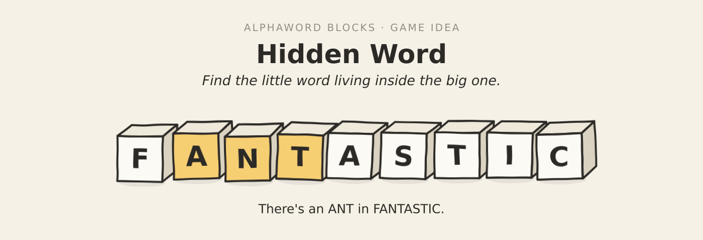</a><br><b>Hidden Word</b><br><sub>find the small word inside the big one</sub></td>
    <td align="center"><a href="idea_hangman.png">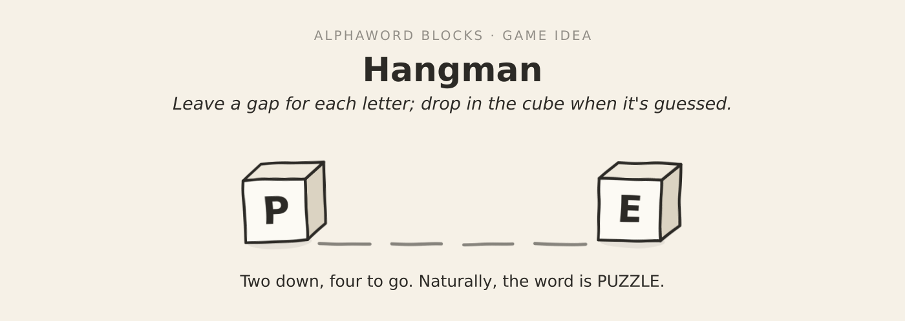</a><br><b>Hangman</b><br><sub>leave a gap, drop in each cube as it's guessed</sub></td>
  </tr>
</table>

By default the program works with **26 cubes of 6 faces** (`N_CUBES = 26`,
`FACES_PER_CUBE = 6`) over the lowercase English alphabet — one hundred and
fifty-six letter-faces to place.

## The cubes

These are the sets bundled with the repository. To spell a word, give each of its
letters a *distinct* cube from the table that carries that letter; if you can, the
word is spellable, and for almost every word you can. The English set is the one
checked by `check_spellable.jl`.

### English — 26 cubes

| Cube | Faces | &nbsp; | Cube | Faces |
|:--:|:--|:--:|:--:|:--|
|  1 | `l t u w x z` | &nbsp; | 14 | `i k t x y z` |
|  2 | `d o r t y z` | &nbsp; | 15 | `b c e f s u` |
|  3 | `l o r t w z` | &nbsp; | 16 | `f h i p w y` |
|  4 | `a i o s v z` | &nbsp; | 17 | `d f p r u v` |
|  5 | `i j o r w z` | &nbsp; | 18 | `a b c d l m` |
|  6 | `b e m n t z` | &nbsp; | 19 | `c e h j l u` |
|  7 | `e o s u y z` | &nbsp; | 20 | `c e m n r v` |
|  8 | `j k l n q s` | &nbsp; | 21 | `a d g i p w` |
|  9 | `j m n o q s` | &nbsp; | 22 | `a b c d e f` |
| 10 | `e g p s t u` | &nbsp; | 23 | `e f k p q r` |
| 11 | `a i l m s u` | &nbsp; | 24 | `a b c g n y` |
| 12 | `h i s u v x` | &nbsp; | 25 | `c f g h o q` |
| 13 | `a g h n t u` | &nbsp; | 26 | `a b c e k o` |

### Numbers & math — a 9-cube extension

The letters are the main event, but the same machinery designs a small companion
box for arithmetic — a **number-and-math extension set** of nine cubes carrying the
digits, the four operation signs, an equals, and a little punctuation. It is a
separate box from the twenty-six letters above; you reach for it when you want to
*play sums* rather than spell words, and the punctuation faces (`$ ' , . ? !`) let it
sit alongside the letters to write prices, times, and whole punctuated sentences.

#### The nine faces

| Cube | Faces | | Cube | Faces |
|---|---|---|---|---|
| 1 | `0` `1` `4` `5` `6` `7` | &nbsp; | 6 | `=` `$` `'` `1` &nbsp;·&nbsp; *two blank* |
| 2 | `0` `1` `2` `3` `7` `8` | &nbsp; | 7 | `1` `2` `6` `7` `8` &nbsp;·&nbsp; *one blank* |
| 3 | `0` `2` `4` `5` `6` `8` | &nbsp; | 8 | `3` `5` `?` `!` `.` &nbsp;·&nbsp; *one blank* |
| 4 | `1` `3` `4` `6` `7` `8` | &nbsp; | 9 | `×` `+` `-` `÷` `2` `/` |
| 5 | `1` `2` `3` `4` `5` `,` | &nbsp; | | |

Fifty printed faces, four left blank — a cube is a physical object, and not every
face has to earn its keep.

#### What it computes

Every operand and every answer is a whole number from 0 to 99. The four operations
are addition, subtraction, multiplication and division, shown `+ − × ÷`. Two rules
keep the answers tidy: subtraction is only offered where the result is non-negative,
so you never meet a minus answer, and division is always exact — no remainders, and
never a division by zero. Enumerating everything the rules allow gives **5,050 sums,
5,050 differences, 672 products and 572 quotients**; together with the bare integers
0–99 that is **11,444 lines in all**, and an exhaustive Julia check confirms that
every single one can be laid out on the nine cubes at once, each glyph on its own
cube. One digit is supplied by a convention rather than a face: there is no `9`
anywhere on the set — a `6` turned a half-turn stands in for it, so the generator
writes a sum like `3 × 3` as `6` and you rotate the cube to read it.

<p align="center">
  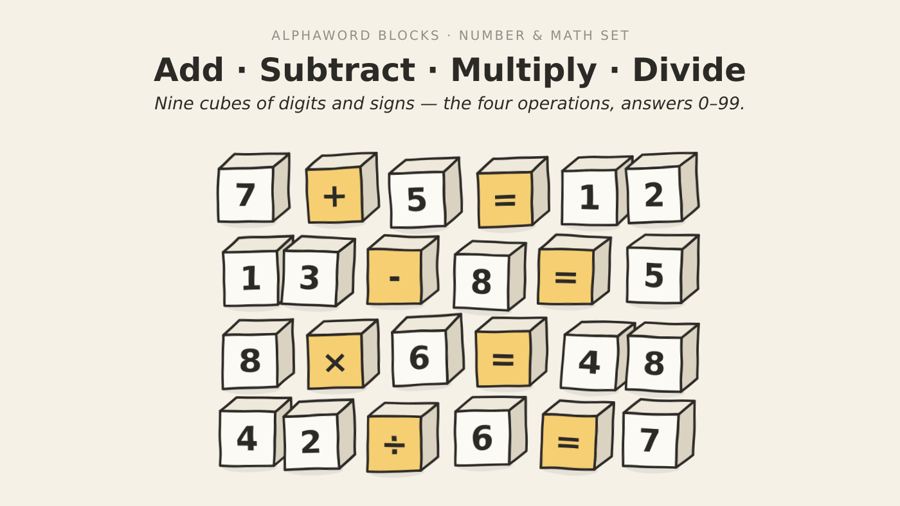
</p>

<p align="center"><sub><em>One equation per operation. Operands and answers all sit between 0 and 99, subtraction never goes negative, and division comes out even.</em></sub></p>

#### Why nine cubes are enough

The coverage argument behind the letter set carries over unchanged. A digit needs as
many cubes as the most times it is ever repeated in a single line, and the heaviest
repeater is `1` — a line like `11 × 1 = 11` asks for four `1`s at once — so `1` is
spread across six of the nine cubes, while the rarer digits sit on three or four
each. The signs never compete with the digits for space: the four operators all
share cube 9 and the equals sits by itself on cube 6, so an operator is always free
no matter which digits a line demands. With the worst repetitions covered and the
punctuation kept apart, the same Hall-style matching test that governs the letter set
passes for the entire enumerated set.

#### Provenance

The extension set is produced by the same optimizer as the letters, with the
equation corpus standing in for the word list — the nine cubes are an optimized
assignment rather than a hand-built table, and every one of the 11,444 lines is
verified spellable on them.

### Bulgarian — 30 cubes

Reported as a construction rather than a measured coverage claim: the Bulgarian
set has not been validated against a corpus as large as Wikipedia.

| Cube | Faces | &nbsp; | Cube | Faces | &nbsp; | Cube | Faces |
|:--:|:--|:--:|:--:|:--|:--:|:--:|:--|
|  1 | `н о ф щ ь ю` | &nbsp; | 11 | `г е ж й л ъ` | &nbsp; | 21 | `в г к п ч ю` |
|  2 | `е л п р с ъ` | &nbsp; | 12 | `а б в г т ц` | &nbsp; | 22 | `а б в г е ч` |
|  3 | `а и н о ш ъ` | &nbsp; | 13 | `а б в г о т` | &nbsp; | 23 | `а б г е у х` |
|  4 | `к м н ч ш щ` | &nbsp; | 14 | `а к х ц ш ь` | &nbsp; | 24 | `е ж з к н т` |
|  5 | `м н п р с ф` | &nbsp; | 15 | `а в к л м о` | &nbsp; | 25 | `а б в д и о` |
|  6 | `з и р с у ю` | &nbsp; | 16 | `б в е и с я` | &nbsp; | 26 | `а б в г м ф` |
|  7 | `а б в д о с` | &nbsp; | 17 | `а б в г д я` | &nbsp; | 27 | `а в е к п х` |
|  8 | `а г й л н с` | &nbsp; | 18 | `а г д й м с` | &nbsp; | 28 | `а в г д и р` |
|  9 | `г е и о с у` | &nbsp; | 19 | `а б в г и т` | &nbsp; | 29 | `а б д е л у` |
| 10 | `б в г ж р т` | &nbsp; | 20 | `б в з о т ъ` | &nbsp; | 30 | `а е з ц щ я` |

## Why so many z's?

By frequency, `z` is the rarest letter in English, and the obvious thing to do is
give it a single cube and move on. Our set puts `z` on **eight** of the twenty-six
cubes — tied for the second-highest count in the whole set, behind only `e` and
`u` at nine each, and level with `a`, `c`, `o` and `s`. The reason is a single
word, and not a common one.

<p align="center">
  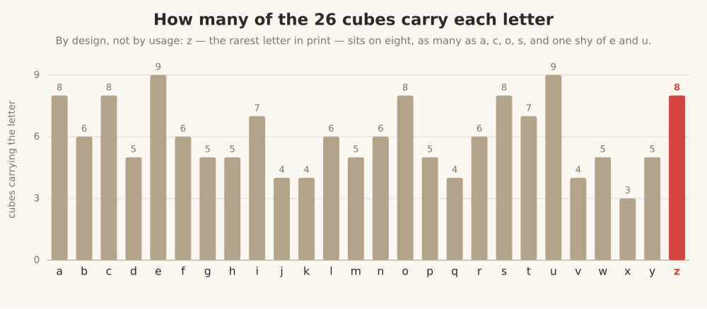
</p>

<p align="center"><sub><em>Coverage per letter. It tracks the worst repetition a letter ever suffers in a single word, not how common the letter is — which is why z stands shoulder-to-shoulder with the vowels.</em></sub></p>

The Tudor mathematician Robert Recorde, inventing names for the powers of an
unknown, reached the eighth power and called it *zenzizenzizenzic*; it survives as
the English word with the most z's, six of them. Continue his recipe one step
further, to the sixteenth power, and you get *zenzizenzizenzizenzic*, which carries
eight z's — alongside four each of `e`, `n`, `i` and a lone `c`. To spell it you
need eight cubes each showing a `z` at the same moment, so eight cubes must carry
`z`, and they do. Note that the fit is tight: those eight z's use up all eight
z-cubes, and removing a single `z` face anywhere would make the word unspellable.

The lesson generalizes, and it runs against intuition. How many cubes a letter
needs is set not by how often the letter is used but by the worst repetition it
ever suffers in a single word. `z` is rare in running text yet crowded onto the
cubes; `e`, which is everywhere, needs just one more cube than `z` does. At the
other end, `x` sits on only three cubes, because no common word piles up four of
them.

## How it works

Deciding whether a single word can be spelled is a bipartite matching problem. Put
the letter-instances of the word on one side and the cubes on the other, join each
instance to every cube that carries its letter, and the word is spellable exactly
when the graph has a matching that saturates the letters — one distinct cube per
letter-instance. By Hall's marriage theorem such a matching exists if and only if
every set of letter-instances is collectively carried by at least as many cubes as
there are instances.

Because every instance of a given letter sees the same cubes, Hall's condition
collapses into something you can check by counting. Write `cov(S)` for the number
of cubes that carry at least one letter of a set `S`. Then a word is spellable
precisely when, for every subset `S` of its letters, `cov(S)` is at least the total
number of times the letters of `S` occur in the word. The singletons `S = {ℓ}` say
the obvious thing: a letter needs at least as many cubes as the most times it is
ever repeated in one word — this is what forces `z` onto eight cubes. The pairs are
where it stops being obvious. Two letters can each have enough cubes on their own
and still fail together, because they crowd the same cubes. The smallest example
lives on three two-faced cubes `{a,b}`, `{a,b}`, `{a,c}`: the word `abab` needs
four cubes drawn from the three that carry an `a` or a `b`, and there are only
three, so it cannot be spelled even though `a` and `b` each clear their own bar.

A whole corpus is just this condition for every word at once. Collect, for each
subset `S` of the alphabet, the largest demand any single word places on it; call
it `need(S)`. A set of cubes spells the entire corpus if and only if
`cov(S) ≥ need(S)` for every `S`. Note that the corpus enters only through
`need(S)`, which we compute in one pass and then never look at the corpus again;
the rest is geometry of the cubes. Most of `need(S)` is zero or redundant, which is
what keeps the table small enough to work with — we store it as per-letter maxima,
then Pareto-maximal demands on pairs and triples, then a capped table for the
longer words.

Designing the cubes is then a search: place the one hundred and fifty-six faces so
that `cov(S) ≥ need(S)` everywhere. We do it with simulated annealing on the total
coverage deficit — the weighted amount by which the cubes currently fall short —
accepting an improving move always and a worsening one with the usual Metropolis
probability, cooling from a hot start, with a few repair modes that differ in how
hard they push on the long, many-letter words. Annealing to zero deficit only
satisfies the constraints we tabulated, and the table is pruned for the longest
words, so we then run the exact matching test over the full corpus in parallel.
Every word that still fails hands back a Hall-violating set of letters — its
certificate — which we add to the table as a hard, unpruned constraint and
re-anneal. Iterating drives the exact miss count down to the handful quoted above.

## Build

Requires a recent stable Rust toolchain.

```sh
cargo build --release
```

Run the commands below **from the repository root**: the program reads its
alphabet config from `src/alphabet.toml` and its word lists from `data/` using
relative paths.

## Run

Interactive optimizer (default mode) — search for a block assignment:

```sh
cargo run --release
```

Useful flags:

| Flag | Default | Meaning |
|------|---------|---------|
| `--seed <i64>` | `0` | PRNG seed for the annealer. |
| `--sweeps <n>` | `200000000` | Number of annealing sweeps. |
| `--max-k <n>` | `20` | Max K for the statistics pass. |
| `--verify <conf>` | – | Verify a config file instead of optimizing, then exit. |

## Verifying a solution

`check_spellable.jl` is a standalone Julia verifier. It loads the same bundled
word lists from `data/` and checks a candidate block set (defined near the top of
the file) against the corpus, reporting any words that cannot be spelled. The
English set in the table above is the one it ships with.

```sh
julia check_spellable.jl
```

## Configuration

`src/alphabet.toml` selects the alphabet. The default enables `latin.ascii.lower`
(lowercase English) with diacritics dropped. The alphabet compiler also supports
many other scripts and packages — Greek, Cyrillic, Latin-with-diacritics, Hebrew,
Georgian, Cherokee, the Japanese kana, and more — see the commented entries in that
file. Bulgarian uses `cyr.bg.lower` with `N_CUBES = 30`.

## Data & licensing

- **Program code:** GNU General Public License v3.0 (see `LICENSE`). Every source
  file carries a GPLv3 header.
- **Word lists:** bundled lists in `data/` are public domain or permissively
  licensed; additional corpora can be fetched with the scripts in
  `download_scripts/`. See **`DATA_SOURCES.md`** for the full provenance and license
  of every corpus, and the attribution required if you redistribute results derived
  from the on-demand sources.

Copyright (C) 2025- Svetlin Tassev.
